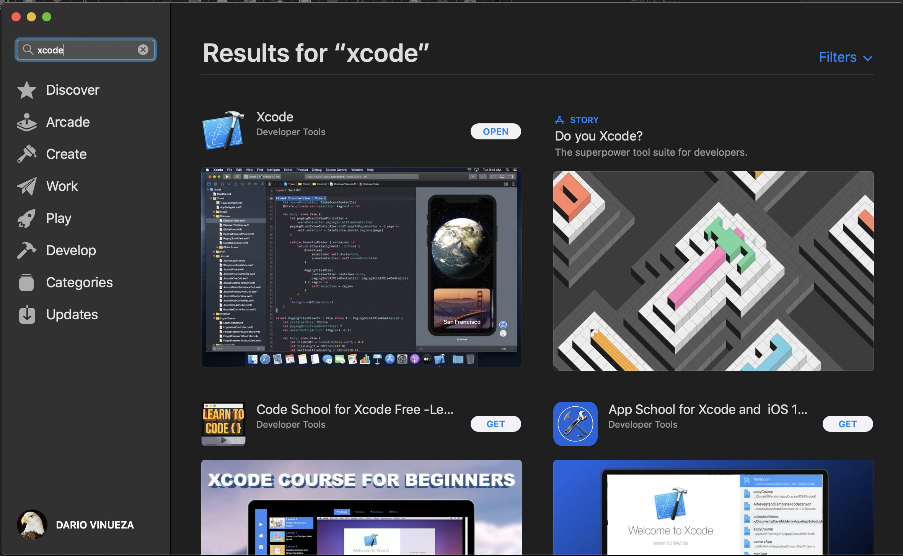

# INSTALACIÓN

El presente documento pretende ser una guía para la instalación de un ambiente para el desarrollo de aplicaciones en ReactNative.

## Node JS

Node.js es un entorno en tiempo de ejecución multiplataforma, de código abierto, para la capa del servidor basado en el lenguaje de programación JavaScript.

[Descargalo aqui](https://nodejs.org/)

## Expo

[Expo](https://expo.io) es un conjunto de herramientas, librerías y servicios los cuales te permiten desarrollar apps nativas en iOS y Android escritas en JavaScript. 

### Comandos de Instalación

    # npm install -g expo-cli

## Android Studio

Android Studio es el entorno de desarrollo integrado (IDE) oficial para el desarrollo de apps para Android, basado en IntelliJ IDEA

[Descargalo aqui](https://developer.android.com/studio)

## Xcode

Visual Studio Code es un editor de código fuente desarrollado por Microsoft para Windows, Linux y macOS.

## Visual Studio Code

[Descargalo aqui](https://code.visualstudio.com/download)