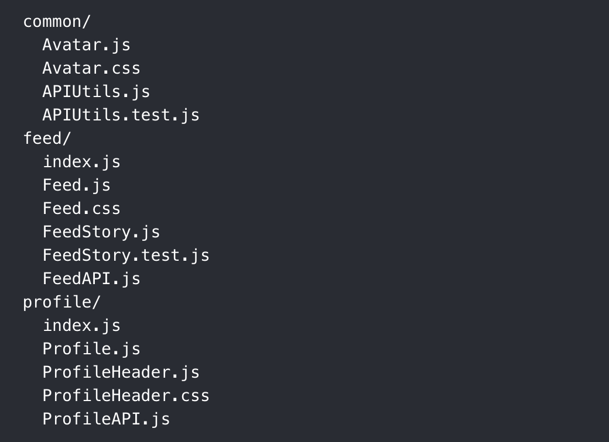

# 2.1 Componentes y Estructuctura de Archivos

## COMPONENTES

**Documentación:** https://reactnative.dev/docs/components-and-apis

React Native define sus componentes en los siguientes grupos:

- **Componentes Básicos:** https://reactnative.dev/docs/components-and-apis#basic-components
- **Interfaz de usuario:** https://reactnative.dev/docs/components-and-apis#user-interface
- **Listas:** https://reactnative.dev/docs/components-and-apis#list-views
- **Componentes de iOS:** https://reactnative.dev/docs/components-and-apis#ios-components-and-apis
- **Componentes de Android:** https://reactnative.dev/docs/components-and-apis#android-components-and-apis
- **Otros:** https://reactnative.dev/docs/components-and-apis#others

## ESTRUCTURTA

**Documentación:** https://es.reactjs.org/docs/faq-structure.html

### ¿Hay una forma recomendada de estructurar los proyectos React?

React no tiene opiniones sobre cómo poner los archivos en carpetas. Dicho esto, hay algunos enfoques comunes que son populares en el ecosistema que podrías considerar.

### Agrupación por funcionalidades o rutas

Una forma común de estructurar proyectos es ubicar CSS, JS y tests juntos dentro de carpetas agrupadas por funcionalidad o ruta.

### Agrupando por tipo de archivo

### Agrupación por funcionalidades o rutas